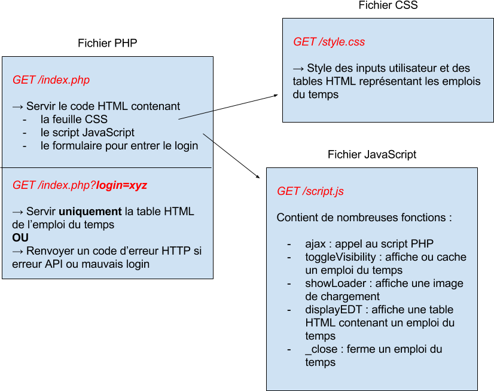
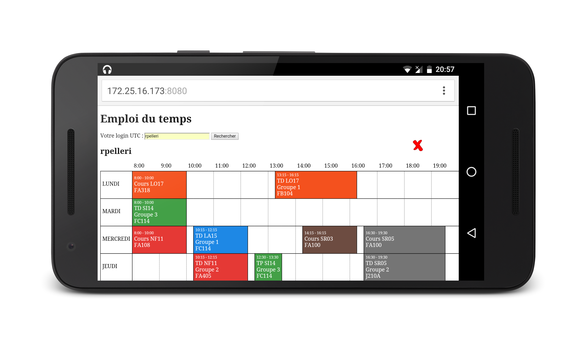

% Projet emploi du temps
% Steve Lagache, Romain Pellerin
% SR03 8 avril 2016

-------------------------------------------

## Cahier des charges

- Emploi du temps
- API de l'UTC
- Afficher 2 emplois du temps en même temps

-------------------------------------------

## Technos

- Front: HTML, CSS, JavaScript
- Back: PHP
- Pas de bibliothèque

-------------------------------------------

## Architecture

-------------------------------------------

## Fonctionnalités

- Messages d'erreur (API indispo, mauvais login)
- Plusieurs emplois du temps **uniques**
- Emplois du temps cachables ou fermables
- Samedi affiché si cours
- *Loading images*

-------------------------------------------

## Mobile

-------------------------------------------

## Desktop

 
DEMO
 
 
Essayez-moi à :
 
<a target="_blank" id="ip_a" href="">http://:8080</a>

-------------------------------------------

Merci

_

Q & A
